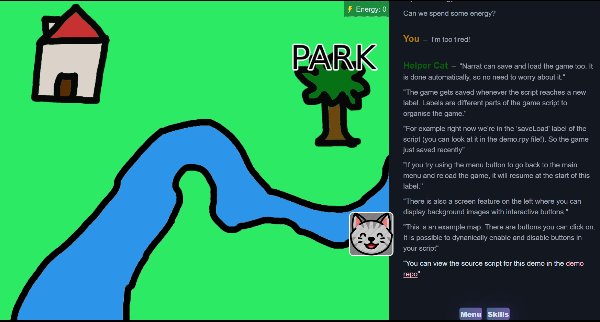

# Screens

## Introduction



In narrat games, the right side of the screen has the dialogue system, while the left side has the screens.

Screens mostly serve to illustrate a scene, in the way visual novel type games do. They can also be used to provide "point and click" features with interactive buttons, or be used as choice menus (for example an interactive map)

## Screens config

```yaml
screens:
  default:
    background: img/backgrounds/curtain.webp
  narrat:
    background: narrat
  map:
    background: img/backgrounds/map.webp
    buttons:
      - id: shopButton
        enabled: false
        text: Shop
        position:
          left: 272
          top: 142
          width: 200
          height: 50
        anchor:
          x: 0.5
          y: 0.5
        action: shopButton
      - id: parkButton
        enabled: false
        text: Park
        position:
          left: 682
          top: 462
          width: 200
          height: 50
        anchor:
          x: 0.5
          y: 0.5
        action: parkButton
```

The path of `screens.yaml` can be customised in the main config file:

```yaml
screens: data/screens.yaml
```

- `background` : This is the id of an image loaded by the engine. Images are defined in the `images` section of the config
- `buttons`: This is an array of ids of interactive buttons that exist in the screen.

## Buttons config

```yaml
buttons:
  parkButton:
    enabled: false
    text: Park
    position:
      left: 682
      top: 462
      width: 200
      height: 50
    anchor:
      x: 0.5
      y: 0.5
    action: parkButton
```

The path of `buttons.yaml` can be customised in the main config file:

```yaml
buttons: data/buttons.yaml
```

- `enabled`: Whether this button is enabled by default or not (this can later be changed on and off in the game's script)
- `background`: ID of the image to use as the image for that button
- `position`: An object with `left`, `top`, `width`, `height` to place the button in pixels relative to the top left of the screen. The size of the screen is defined in the `layout` part of the config, for reference.
- `action`: Defines which script label should be run when the button is clicked.

For example, with the following game script:

```narrat
parkButton:
  "You have reached the park!"
```

This script would be triggered by pressing the `parkButton` in the `map` screen defined above.

::: danger
The `default` screen must always exist, as it is the first screen the game gets loaded with.
:::

## Button interaction tags

Buttons can also have a `tag` property in their config to use interaction tag, the same way inventory items can. See the guide below for more info on interaction tags (in the interaction tags section):

[items.md](../features/items.md)

## Controlling screens and buttons in scripts

### Changing Screen

The `set_screen` function switches the game to a different screen:

```narrat
set_screen map
```

### Enabling and disabling buttons

The `set_button` function can enable or disable a button

```narrat
set_button parkButton true
```
