# Customising the UI theme

Because narrat games are built using standard web tools (HTML/CSS/JS), it is possible to customise the styling of every element in the game using custom CSS.

## How CSS works

In short, CSS is a way to style web elements by giving styling properties to elements selected by a rule. For example:

```css
.button {
  background-color: red;
}
```

This rule would give a red background color to any element with the `button` css class. For more info, look at the [w3schools CSS intro](https://www.w3schools.com/css/css_intro.asp) and don't be afraid to Google how to do things in CSS

## How to use CSS in Narrat

There are two ways to use CSS to customise your UI in Narrat. One is to edit CSS variables provided to override things like common colors, and the other is to write your own CSS classes to override existing ones from the engine.

::: danger
If you use images in your css, paths should start with `/`, or the assets won't be found in the built version.
For example: `background-image: url('/images/my-image.png');` instead of `background-image: url('images/my-image.png');`
:::

## CSS Variables

### Introduction

::: details How CSS Variables work

A CSS variable is simply a CSS property value stored in a variable. This allows the user to reuse that variable in multiple places. Using variables for common colors, sizes, backgrounds or others can combine into an easy to edit theme. For example, here's some of the default CSS in Narrat:

```css
:root {
  --text-color: #d9e1f2;
  --light-1: hsl(210, 30%, 40%);
  --light-2: hsl(255, 30%, 50%);
  --light-background: linear-gradient(to right, var(--light-1), var(--light-2));
}

.button {
  background: var(--light-background);
  color: var(--text-color);
}

.input {
  background: var(--light-background);
  color: var(--text-color);
}
```

The CSS code above creates some variables to store specific colors, and those colors are then reused in various CSS classes. This means changing the value of `--text-color` will apply the change to all CSS using it

:::

Here is a list of the CSS variables that exist in narrat:

::: details CSS Variables available to override in Narrat

```css
:root {
  --font-family: 'Helvetica', sans-serif, 'Arial', 'sans-serif';
  --bg-color: rgba(19, 23, 32, 0.9);
  --text-color: #d9e1f2;
  --grey-text-color: #a6a6a6;
  --primary: hsl(255, 30%, 55%);
  --focus: hsl(210, 90%, 50%);
  --secondary: #42b983;
  --border-color: hsla(0, 0%, 100%, 0.2);
  --light-1: hsl(210, 30%, 40%);
  --light-2: hsl(255, 30%, 50%);
  --light-gradient: linear-gradient(to right, var(--light-1), var(--light-2));
  --light-background: rgba(255, 255, 255, 0.3);
  --button-background: var(--tile-background);
  --button-text-color: var(--text-color);
  --modal-gradient-1: rgba(18, 21, 26, 0.8);
  --modal-gradient-2: rgba(37, 40, 44, 0.6);
  --modal-background: linear-gradient(
    90deg,
    var(--modal-gradient-1) 0%,
    var(--modal-gradient-2) 100%
  );
  --tile-gradient-1: rgba(18, 21, 26, 0.9);
  --tile-gradient-2: rgba(37, 40, 44, 0.7);
  --tile-background: linear-gradient(
    90deg,
    var(--tile-gradient-1) 0%,
    var(--tile-gradient-2) 100%
  );
  --tile-border-color: rgba(166, 166, 166, 0.3);
  --shadow-1: hsla(236, 50%, 50%, 0.3);
  --shadow-2: hsla(236, 50%, 50%, 0.4);
  --hud-background: rgba(0, 0, 0, 0.4);
  --hud-text-color: var(--text-color);

  --notification-bg: var(--tile-background);
  --notification-text-color: var(--text-color);
  --notification-description-color: var(--grey-text-color);
  --notification-icon-size: 40px;

  --skills-text-background: rgba(0, 0, 0, 0.5);
  --skills-text-color: var(--text-color);
  --skills-level-background: rgba(0, 0, 0, 0.5);
  --skills-level-color: orange;
  --skills-xp-bar-height: 40px;

  --skill-check-name-color: orange;
  --skill-check-difficulty: orange;
  --skill-check-success: green;
  --skill-check-failed: red;
  --skill-check-color: orange;

  --dialog-choice-color: orange;
  --dialog-choice-hover-color: var(--text-color);

  --inventory-text-background: rgba(0, 0, 0, 0.5);
  --inventory-text-color: var(--text-color);
  --inventory-amount-background: rgba(0, 0, 0, 0.5);
  --inventory-amount-color: orange;

  --quest-title-color: yellow;
  --completed-quest-title-color: grey;

  --objective-in-progress-color: white;
  --objective-completed-color: grey;

  --loading-bar-inner-bg: var(--light-background);
  --loading-bar-outer-bg: var(--bg-color);

  --dialog-box-bg: var(--bg-color);
  --dialog-box-border: none;

  /* Tabs */
  --tabs-background: linear-gradient(
    90deg,
    rgba(0, 0, 0, 0.2) 0%,
    rgba(100, 100, 100, 1) 53%,
    rgba(0, 0, 0, 0.2) 100%
  );
  --tab-active-background: rgba(0, 0, 0, 0);
  --tab-active-text-color: var(--text-color);
  --tab-inactive-background: rgba(0, 0, 0, 0);
  --tab-inactive-text-color: var(--text-color);
  --tab-border-style: solid;
  --tab-border-color: white;
  --tab-selected-glow-color: var(--focus);

  --tooltip-background: #331d00;
  --tooltip-border: 1px solid orange;
  --tooltip-border-radius: 5px;
  --tooltip-title-font-size: 1.2rem;
  --tooltip-font-size: 1rem;
  --tooltip-title-color: red;
  --tooltip-color: var(--text-color);

  --highlighted-tooltip-keyword-color: red;
  --highlighted-tooltip-keyword-font-size: 1.1em;
  --highlighted-tooltip-keyword-font-weight: bold;

  --achievement-title-color: var(--text-color);
  --achievement-tile-background: var(--tile-background);
  --achievement-tile-border-color: var(--tile-border-color);
  --achievement-description-color: rgb(170, 170, 170);

  --separator-bg-color: rgba(250, 250, 250, 0.8);
  --separator-height: 1px;
  --separator-width: 100%;
}
```

:::

::: tip
To see the most up to date list of CSS variables, look at [main.css](https://github.com/liana-p/narrat-engine/blob/main/packages/narrat/src/css/main.css#L1) in the engine
:::

## Note on images preloading

Any **images referred to in your CSS won't be preloaded by default**, because the engine doesn't know about them.

If you need to preload them, add them to the list of images in the `config.yaml`:

```yaml
images:
  myButtonBackground: img/ui/button-background.png
```

## Using custom fonts

You can use custom fonts in narrat, see the [Custom fonts guide](./using-custom-fonts.md) to learn how to do it.

## Creating custom CSS classes

### Setup

The CSS variables above allow for easy customisation of common properties, but for deeper changes the best way is to write custom CSS classes. Most of the UI elements in narrat have a specific CSS class name or id which you can use to write custom CSS for them.

For example, the `.interact-button` is the CSS class given to the "Continue" button in the game's dialog UI, so writing CSS for it will change how that button looks:

```css
.interact-button {
  background-image: url('img/ui/continue.png');
  color: rgba(0, 0, 0, 0) !important;
}

.interact-button:hover {
  background-image: url('img/ui/continue_hover.png') !important;
}
```

::: tip
Note the `!important` parameter at the end. This helps your CSS property override an existing one in the engine, as it tells CSS to make this value take priority.
:::

To be able to add custom CSS, you need a CSS file. The template already comes with one, but if for any reason you don't have any, all you need to do is create a `.css` file and import it inside your `index.ts`.

For example:

1. Create a folder `css` in the `src` folder, then a file called`main.css` in it
2. In `src/index.ts`, add the following: `import "./css/main.css";`
3. Any CSS you now add in main.css will be loaded in your game

### How to find CSS classes to override

#### Using the devtools

::: details How to find the CSS class and id of elements to theme them

The easiest way to find a CSS class name or id to override for theming a game is to use the browser inspector (right-click -> inspect on Chrome or Firefox).

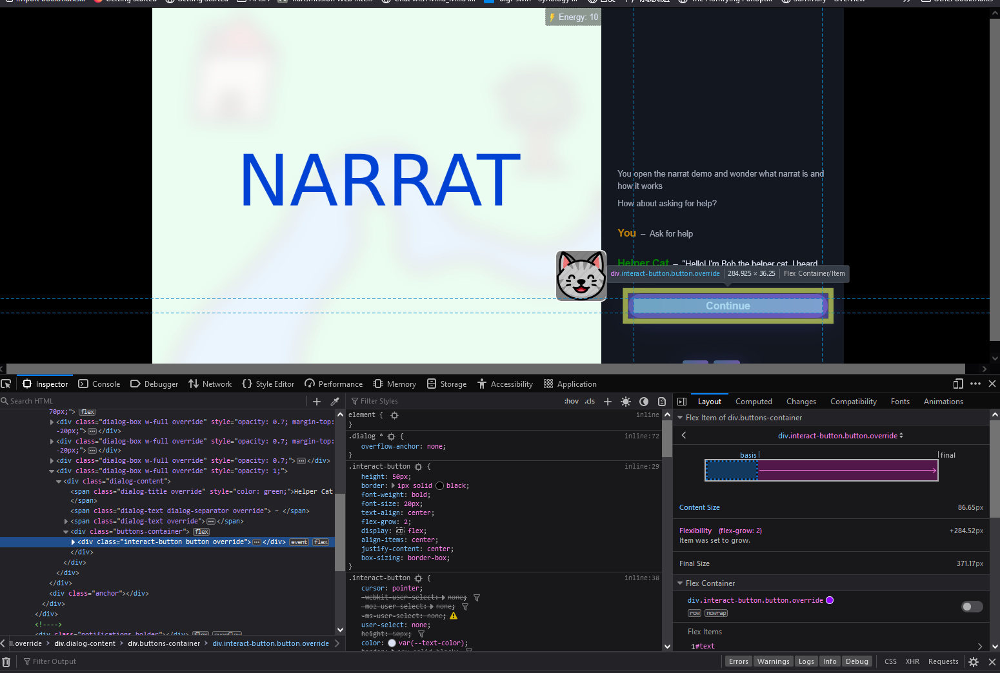

The devtools have a list of all the elements on the page in the elements tab (bottom left in the screenshot). This tool shows a tree view of all the DOM elements that constitute a web page (the narrat UI is made of DOM elements)Available CSS classes to override


Clicking on the arrow icon in the top left of the devtools opens a "picker" tool that allows clicking anywhere on the page to select an element in the elements view of the devtools. This makes it very easy to browse and find elements on a page.

Finding the css class or id for an element is then just a matter of looking at what's in the HTML for that element in the devtools after finding it with the picker:


Hovering elements in the elements tab also highlights them on the page.

The `class` property in an element is the CSS class name. Some elements also have an `id` property, which is the CSS id.

:::

### CSS class and CSS id

Once a css class or id has been found to edit an element, it's simply a matter of adding CSS for it. To create CSS for a class, the selector needs to start with `.` followed by the class name. For an id it's `#`. For example:

```css
.interact-button {
  /* This selector applies to the CSS class named "interact-button" */
  color: red !important;
}

#interact-button {
  /* This selector applies to the css ID named "interact-button" */
  color: red !important;
}
```

::: warning
Be careful not to confuse CSS classes and ids, as the syntax for their selector is different.
:::

### List of useful CSS classes to override

::: tip
`This list is a work in progress. If you can't find something or if it's been changed, use the instructions above to find it yourself in the game`
:::

#### Buttons

::: details Buttons CSS

`.button`: Generic base class applied to all buttons


`.interact-button`: The "Continue" button during dialogue


`.dialog-choice`: The selectable choices in the dialogue


`.menu-button`: The two "start game" and "continue game" buttons

`.start-button`


`.continue-button`


:::

#### UI Elements

::: details Other UI Elements

.dialog-container: Contains all the dialog

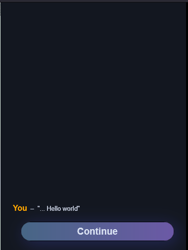

.dialog: The entire right-side box of the screen that is scrollable with all the dialog in it

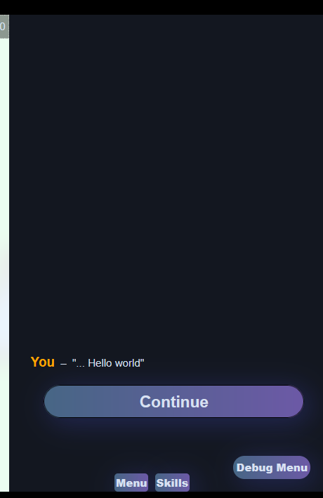

.menu-container


:::

::: details General modal CSS

.modal-mask: The half-opaque overlay on the page when a modal is open

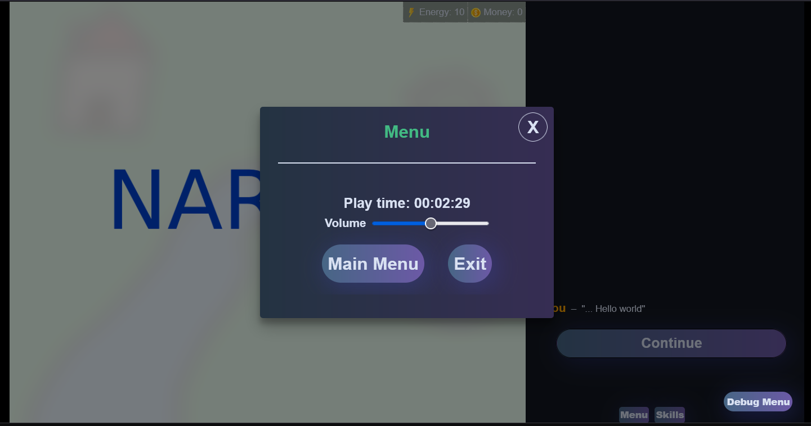

.modal-container: The container class for all modals

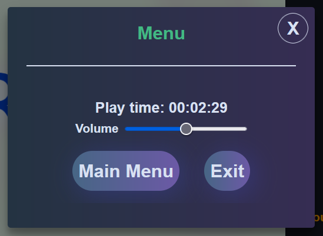

.modal-header

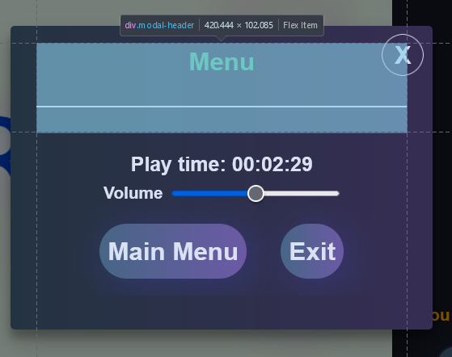

.modal-body

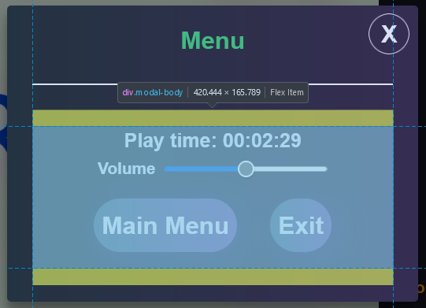

:::

#### Skills Screen

::: details Skills Screen CSS

.skills-container

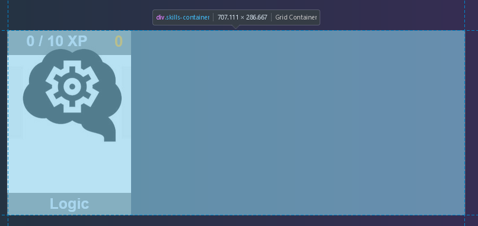

One thing worth knowing is the `.skills-container` class in the skills screen uses [CSS grid](https://learncssgrid.com/). To change how many columns there are per row, overriding the `grid-template-columns` works. For example:

```css
.skills-container {
  grid-template-columns: repeat(
    4,
    1fr
  ); /* The first number in repeat is the number of desired columbns */
  grid-gap: 30px 30px; /* Space between elements */
}
```

.skill-display: The individual tile for a skill

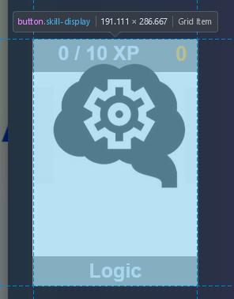

.skill-title

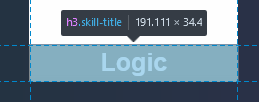

.skill-xp-container and .skill-xp-bar: skill-xp-container is the background of the xp progress bar, whereas skill-xp-bar is the inner bar that gets filled depending on the amount of xp

.skill-xp-text is also the text of the xp

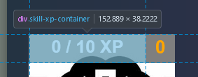

.skill-level

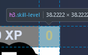

:::
